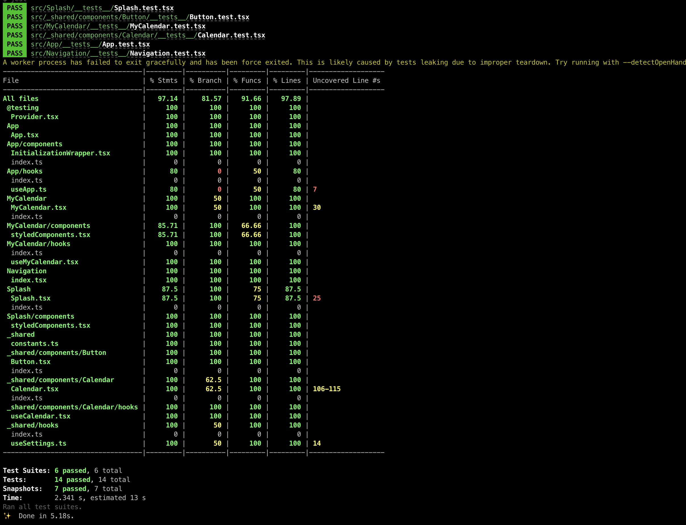

# Getting Started with Custxmer Calendar

This project was bootstrapped with [npx react-native init](https://reactnative.dev/docs/environment-setup).

## Available Scripts

In the project directory, you can run:

### `yarn ios/ yarn android`

Runs the app in the development mode on your simulator or physical device.\
The page will reload if you make edits.\
You will also see any lint errors in the console.

### `npm test`

Launches the test runner in the interactive watch mode.\
See the section about [running tests](https://reactnative.dev/docs/testing-overview) for more information.

